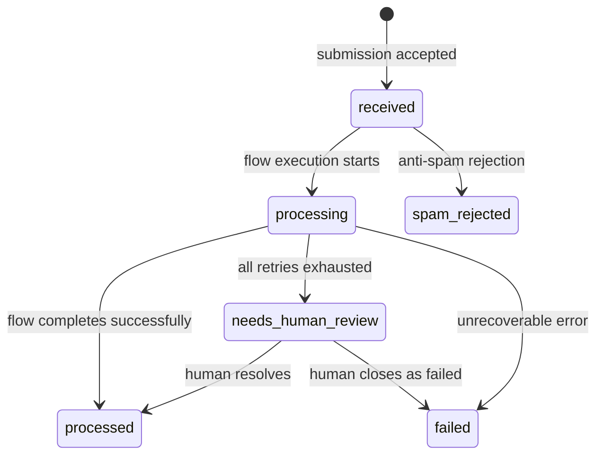
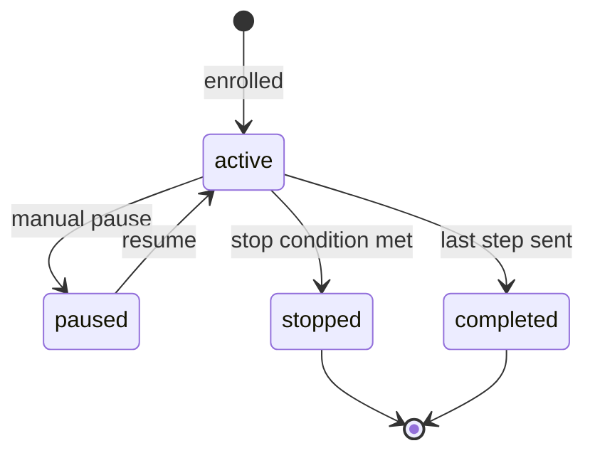

# Aggregates

> Aggregate roots define consistency boundaries. All modifications go through the root. External references use the root's ID only.

See also: [Entities](./entities.md) | [Value Objects](./value-objects.md) | [Repositories](./repositories.md)

---

## 1. Workspace Aggregate

**Root:** `Workspace`
**Context:** Identity & Access
**Table:** `workspaces`

**Consistency Boundary:**
```
Workspace (root)
  +-- WorkspaceMembership[]    (workspace_memberships table)
  +-- ApiKey[]                 (api_keys table)
  +-- Session[]                (sessions table)
```

**Invariants:**
- Every workspace has exactly one owner (the account that created it)
- A workspace slug is globally unique
- An account can appear in at most one membership per workspace (`UNIQUE(workspace_id, account_id)`)
- Only owner or admin roles can invite members
- API keys are scoped to exactly one workspace

**Lifecycle States:**
- `active` -- normal operation
- `suspended` -- disabled by system (future)

**External References:** All other aggregates reference `workspace_id` as a foreign key for data isolation. The workspace does not hold direct references to forms, contacts, etc. -- it is the implicit scope for everything.

---

## 2. Account Aggregate

**Root:** `Account`
**Context:** Identity & Access
**Table:** `accounts`

**Consistency Boundary:**
```
Account (root)
  (no embedded entities -- memberships belong to Workspace aggregate)
```

**Invariants:**
- Email is globally unique across all accounts
- Password is stored as bcrypt hash (never plaintext)
- Status must be `active` to authenticate

**Lifecycle States:**
- `active` -- can login and operate
- `inactive` -- disabled

**Note:** Account is a lean aggregate. Memberships are owned by the Workspace aggregate because membership rules (roles, invitations) are workspace-scoped concerns.

---

## 3. Form Aggregate

**Root:** `Form`
**Context:** Form Management
**Table:** `forms`

**Consistency Boundary:**
```
Form (root)
  +-- FormField[]              (JSON column: fields)
  +-- SecurityConfig           (JSON column: security_config)
  +-- AgentConfig              (JSON column: agent_config)
  +-- ResponseConfig           (JSON column: response_config)
  +-- AutoConfig               (JSON column: auto_config)
  +-- FieldMapping             (JSON column: field_mapping)
```

All child value objects are stored as JSON columns within the forms table. They are always loaded and saved with the form -- there is no independent lifecycle.

**Invariants:**
- Form slug is unique within a workspace (`UNIQUE(workspace_id, slug)`)
- `flow_id` must be one of 6 valid flows
- `fields` must contain at least one field
- If `agent_config.autonomy_level` is set, `entity` must reference a handler capable of agent processing
- `security_config.honeypot_field` defaults to `_hp`
- A form can have at most one active experiment at a time (enforced by Experimentation context)

**Lifecycle States:**
- `active` -- accepting submissions
- `paused` -- form exists but rejects submissions
- `archived` -- soft deleted, not queryable in lists

---

## 4. Submission Aggregate

**Root:** `Submission`
**Context:** Inbound Processing
**Table:** `submissions`

**Consistency Boundary:**
```
Submission (root)
  +-- SubmissionMeta           (JSON column: meta)
  +-- FieldInteraction{}       (JSON column: field_interactions)
  +-- AgentAction[]            (JSON column: actions)
  +-- CreatedEntities          (JSON column: created_entities)
```

**Invariants:**
- A submission always references a valid form_id
- `workspace_id` is denormalized from the form at creation time
- Status transitions follow a defined state machine (see below)
- `actions` array is append-only during processing
- `processing_duration_ms` = `processed_at` - `created_at` (computed on completion)

**Status State Machine:**


**Lifecycle States:**
- `received` -- stored, pending flow execution
- `processing` -- flow is actively executing
- `processed` -- all steps completed successfully
- `needs_human_review` -- escalated after errors
- `failed` -- terminal failure
- `spam_rejected` -- blocked by anti-spam

---

## 5. Contact Aggregate

**Root:** `Contact`
**Context:** Contact & CRM
**Table:** `contacts`

**Consistency Boundary:**
```
Contact (root)
  +-- Touchpoint[]             (JSON column: touchpoints)
  +-- custom_fields{}          (JSON column: custom_fields)
  +-- tags[]                   (JSON column: tags)
  +-- ContactNote[]            (contact_notes table)
```

ContactNote is a separate table with `contact_id` FK. It is append-only and always accessed through the Contact aggregate.

**Invariants:**
- Email is unique within a workspace (`UNIQUE(workspace_id, email)`)
- `submission_count` is incremented on each new linked submission
- `last_seen` is updated on every new submission
- Touchpoints are append-only (never modified or deleted)
- Existing field values are not overwritten during merge -- only empty fields are filled

**Lifecycle States:**
- `lead` -- initial status from form submission
- `qualified` -- agent or human marked as qualified
- `customer` -- converted (deal won)
- `unsubscribed` -- opted out of communications

---

## 6. HandlerGroup Aggregate

**Root:** `HandlerGroup`
**Context:** Routing
**Table:** `handler_groups`

**Consistency Boundary:**
```
HandlerGroup (root)
  +-- GroupMember[]            (JSON column: members)
  +-- GroupSettings            (JSON column: settings)
  +-- last_assigned_index      (integer column)
  +-- assignment_count{}       (JSON column)
```

**Invariants:**
- At most one member can have `role: "principal"` per group
- `routing_strategy` must be one of: principal, round_robin, least_loaded, broadcast
- `last_assigned_index` is only meaningful for round_robin strategy
- `assignment_count` is only meaningful for least_loaded strategy
- If strategy is `principal`, a principal member must exist or `settings.fallback_handler_id` must be set

**Concurrency:** The `last_assigned_index` and `assignment_count` fields require atomic updates to prevent double-assignment under concurrent submissions. In SQLite this is handled by the database-level write lock.

---

## 7. Campaign Aggregate

**Root:** `Campaign`
**Context:** Marketing Automation
**Table:** `campaigns`

**Consistency Boundary:**
```
Campaign (root)
  +-- inbound_form_ids[]       (JSON column)
  +-- contact_tags[]           (JSON column)
```

The Campaign aggregate is relatively flat. Sequences and enrollments are separate aggregates because they have independent lifecycles.

**Invariants:**
- `inbound_form_ids` must reference valid forms in the same workspace
- `nurture_sequence_id` (if set) must reference a valid sequence in the same workspace
- Campaign tags are applied to contacts upon enrollment

**Lifecycle States:**
- `active` -- accepting new contacts
- `paused` -- no new enrollments, existing sequences continue
- `completed` -- campaign ended
- `archived` -- soft deleted

---

## 8. Sequence Aggregate

**Root:** `Sequence`
**Context:** Marketing Automation
**Table:** `sequences`

**Consistency Boundary:**
```
Sequence (root)
  +-- SequenceStep[]           (sequence_steps table, ordered by "order")
```

SequenceStep is a child entity owned by the Sequence aggregate. Steps are always loaded and managed through the sequence.

**Invariants:**
- Steps must have unique, contiguous `order` values within a sequence
- `stop_conditions` is an array of valid condition identifiers
- At least one step is required for the sequence to be enrollable

**Lifecycle States:**
- `active` -- can accept enrollments
- `paused` -- no new enrollments
- `archived` -- soft deleted

---

## 9. Enrollment Aggregate

**Root:** `Enrollment`
**Context:** Marketing Automation
**Table:** `enrollments`

**Consistency Boundary:**
```
Enrollment (root)
  +-- EnrollmentHistory[]      (JSON column: history)
```

Enrollment is a separate aggregate (not a child of Sequence) because it tracks an individual contact's progression and has its own lifecycle, state machine, and background processing.

**Invariants:**
- A contact cannot be enrolled in the same sequence twice concurrently (checked at enrollment time)
- `current_step` must be <= total steps in the referenced sequence
- `next_step_due_at` is computed from step delay configuration
- History entries are append-only

**Status State Machine:**


---

## 10. Experiment Aggregate

**Root:** `Experiment`
**Context:** Experimentation
**Table:** `experiments`

**Consistency Boundary:**
```
Experiment (root)
  +-- Variant[]                (JSON column: variants)
  +-- OptimizationLogEntry[]   (JSON column: optimization_log)
```

**Invariants:**
- Only one active experiment per form at any time
- Each variant has a unique `id` within the experiment
- Variant weights must sum to 100 (or be normalized)
- `min_sample_size` must be >= 1
- Winner can only be declared when all variants have >= `min_sample_size` submissions
- Winner must beat runner-up by >10% to be promoted
- Required fields from the base form cannot be removed in variant overrides
- Every optimization action is logged in `optimization_log`

**Lifecycle States:**
- `draft` -- configured but not yet splitting traffic
- `active` -- actively splitting traffic
- `completed` -- winner declared, experiment ended
- `archived` -- soft deleted

---

## Aggregate Reference Rules

1. **Cross-aggregate references use IDs only.** A Submission stores `form_id` and `contact_id`, not embedded Form or Contact objects.
2. **All aggregates carry `workspace_id`.** This is the tenant isolation key. Tables that inherit workspace via FK (contact_notes, sequence_steps) do not store workspace_id directly.
3. **JSON-embedded children have no independent identity.** FormField, Variant, Touchpoint, etc. are value objects stored within their parent aggregate's JSON columns.
4. **Table-embedded children (ContactNote, SequenceStep) have identity** but are always accessed through their parent aggregate root.
