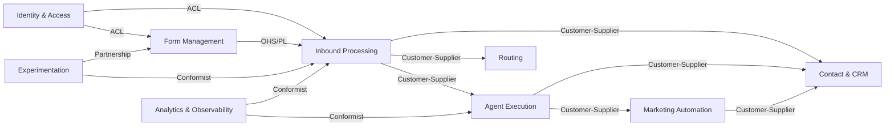

# Bounded Contexts

> Each bounded context owns a cohesive slice of the FormAgent domain with explicit boundaries and integration contracts.

See also: [Domain Model](./domain-model.md) | [Aggregates](./aggregates.md) | [Services](./services.md)

---

## 1. Identity & Access Context

**Purpose:** Authenticate users, manage multi-tenant workspaces, enforce data isolation.

**Key Models:** Account, Workspace, WorkspaceMembership, Session, ApiKey

**Owned Tables:** `accounts`, `workspaces`, `workspace_memberships`, `api_keys`, `sessions`

**Responsibilities:**
- User signup, login, logout
- JWT generation and validation
- API key lifecycle (create, hash, validate, revoke)
- Workspace creation and member management (invite, role assignment)
- AuthContext extraction on every authenticated request
- RBAC enforcement (owner, admin, member, viewer)

**Integration Pattern:** **Upstream supplier** -- every other context depends on the `AuthContext(account_id, workspace_id, role)` provided by the `get_current_context` middleware. This is a synchronous in-process dependency.

**Invariants:**
- Every query in every context must include `WHERE workspace_id = ?`
- One account can own multiple workspaces
- Email uniqueness is global for accounts, per-workspace for contacts
- API key full value is shown once; only the SHA-256 hash is stored

---

## 2. Form Management Context

**Purpose:** Create, configure, and serve form schemas.

**Key Models:** Form, FormField, SecurityConfig, AgentConfig, ResponseConfig, AutoConfig

**Owned Tables:** `forms`

**Responsibilities:**
- Natural language form generation (typed request via Claude)
- Visual editor CRUD (fields, ordering, validation)
- Handler assignment (entity + entity_id)
- Embed code generation
- Form schema serving (public endpoint for embedded forms)
- Applying experiment variant overrides to schemas

**Relationships:**
| Context | Direction | Integration |
|---------|-----------|-------------|
| Identity & Access | Upstream | workspace_id on all forms |
| Inbound Processing | Downstream | Provides form config, flow_id, fields for validation |
| Experimentation | Bidirectional | Receives variant overrides; schema endpoint applies them |
| Analytics & Observability | Downstream | Field interaction data feeds analytics |

**Integration Pattern:** Synchronous query -- Inbound Processing loads form config by form_id at submission time.

---

## 3. Inbound Processing Context

**Purpose:** Receive submissions, run anti-spam, resolve contacts, and execute the appropriate processing flow.

**Key Models:** Submission, SubmissionMeta, FieldInteraction, SpamLogEntry

**Owned Tables:** `submissions`, `spam_log`

**Responsibilities:**
- Accept form submissions from external websites (public endpoint, no auth)
- CORS validation against form's allowed_origins
- Field validation (type, required, length, regex)
- Anti-spam pipeline (honeypot, IP rate limit, email rate limit, duplicate detection)
- Contact matching and company matching (delegates to Contact & CRM)
- Attribution tracking (touchpoint creation)
- Flow execution dispatch (delegates to the appropriate flow)
- Experiment variant tagging
- Sync/async split: steps 1-8 synchronous, agent routing asynchronous

**Relationships:**
| Context | Direction | Integration |
|---------|-----------|-------------|
| Form Management | Upstream | Loads form config for validation and flow selection |
| Contact & CRM | Downstream | Triggers contact/company match-or-create |
| Agent Execution | Downstream | Hands off submission to agent pipeline (async) |
| Routing | Downstream | Requests handler assignment |
| Experimentation | Upstream | Receives variant_id to tag on submission |
| Analytics & Observability | Downstream | Emits events for every pipeline step |

**Integration Pattern:** The submission endpoint is the system's primary entry point. It orchestrates across contexts via the FlowEngine application service.

---

## 4. Contact & CRM Context

**Purpose:** Maintain stateful contact memory, companies, deals, and attribution chains.

**Key Models:** Contact, Company, Deal, ContactNote, Touchpoint

**Owned Tables:** `contacts`, `contact_notes`, `companies`, `deals`

**Responsibilities:**
- Contact resolution (match by email or create)
- Company resolution (match by name or create, link to contact)
- Touchpoint tracking (submission_id, form_id, UTMs, page_url, timestamp)
- Contact enrichment (merge new data without overwriting existing)
- Deal lifecycle (create, update stage, link to contact/company/submission)
- Tag management on contacts
- Submission count tracking

**Relationships:**
| Context | Direction | Integration |
|---------|-----------|-------------|
| Inbound Processing | Upstream | Called during flow execution for contact/company matching |
| Agent Execution | Upstream | Agents create deals, add notes, update tags |
| Marketing Automation | Bidirectional | Sequences reference contacts; campaigns apply tags |
| Analytics & Observability | Downstream | Contact/deal data feeds attribution analytics |

**Integration Pattern:** Synchronous service calls from Inbound Processing and Agent Execution. The Contact aggregate is the shared kernel between these contexts.

---

## 5. Agent Execution Context

**Purpose:** Build agent prompts, call Claude API, validate and execute actions, handle errors.

**Key Models:** Draft, AgentAction, Error

**Owned Tables:** `drafts`, `errors`

**Responsibilities:**
- Build rich agent prompts (form purpose, submission data, contact history, allowed actions, autonomy instructions)
- Call Claude API with structured output expectations
- Validate returned actions against allowed_actions guardrails
- Execute or draft actions based on autonomy_level
- Action execution: qualify_lead, send_email, create_deal, create_ticket, book_meeting, enroll_sequence, escalate, respond_direct
- Draft workflow (pending, approved, rejected)
- Error recovery (retry with backoff, re-prompt, escalate)
- Emit events for every step (processing, action, completion, error, retry)

**Relationships:**
| Context | Direction | Integration |
|---------|-----------|-------------|
| Inbound Processing | Upstream | Receives submission context after routing |
| Routing | Upstream | Receives assigned handler info |
| Contact & CRM | Downstream | Creates deals, adds notes, updates tags |
| Marketing Automation | Downstream | May trigger sequence enrollment |
| Analytics & Observability | Downstream | Emits granular processing events |

**Integration Pattern:** Asynchronous execution via daemon thread. The agent pipeline is fire-and-forget from the submission endpoint's perspective.

---

## 6. Routing Context

**Purpose:** Select the correct handler for a submission using configurable strategies.

**Key Models:** HandlerGroup, GroupMember, RoutingStrategy

**Owned Tables:** `handler_groups`

**Responsibilities:**
- Maintain handler groups with typed members (agent or human)
- Execute routing strategies: principal, round_robin, least_loaded, broadcast
- Track routing state (last_assigned_index, assignment_count)
- Fallback logic when all members inactive or group empty

**Relationships:**
| Context | Direction | Integration |
|---------|-----------|-------------|
| Form Management | Upstream | Form references handler group via entity/entity_id |
| Inbound Processing | Upstream | Called during flow execution to select handler |
| Agent Execution | Downstream | Provides the selected handler to the agent pipeline |

**Integration Pattern:** Synchronous function call within the flow engine. The HandlerGroup aggregate encapsulates all routing state.

---

## 7. Marketing Automation Context

**Purpose:** Manage campaigns and nurture sequences for contact engagement.

**Key Models:** Campaign, Sequence, SequenceStep, Enrollment

**Owned Tables:** `campaigns`, `sequences`, `sequence_steps`, `enrollments`

**Responsibilities:**
- Campaign lifecycle (create, link forms, configure welcome email, set tags)
- Sequence definition (steps with delays, email templates, optional agent personalization)
- Enrollment management (enroll, pause, resume, stop, advance)
- Background sequence processor (every 60s: check due steps, evaluate stop conditions, send emails, advance enrollment)
- Variable substitution in email templates
- Stop condition evaluation (contact_replied, deal_created, manual_stop, contact_unsubscribed)

**Relationships:**
| Context | Direction | Integration |
|---------|-----------|-------------|
| Inbound Processing | Upstream | email_marketing flow adds contacts to campaigns and enrolls in sequences |
| Agent Execution | Upstream | Agents may trigger enroll_sequence action |
| Contact & CRM | Bidirectional | Enrollments reference contacts; campaigns apply tags to contacts |
| Form Management | Upstream | Campaigns reference inbound_form_ids |

**Integration Pattern:** The sequence processor runs as a background daemon thread on a 60-second interval. Campaign enrollment is triggered synchronously from flows or agent actions.

---

## 8. Experimentation Context

**Purpose:** A/B test form variants and auto-optimize via agent autopilot.

**Key Models:** Experiment, Variant, OptimizationLogEntry

**Owned Tables:** `experiments`

**Responsibilities:**
- Experiment lifecycle (create, activate, complete, archive)
- Variant definition with weight-based traffic splitting
- Variant stats computation (submissions, conversions, deals, revenue per variant)
- Weighted random variant selection at schema-serve time
- Agent autopilot optimization (promote winner, generate challenger via Claude)
- Guardrails enforcement (min sample size, >10% improvement threshold, required fields preserved)
- Optimization audit log

**Relationships:**
| Context | Direction | Integration |
|---------|-----------|-------------|
| Form Management | Bidirectional | Reads base form fields; applies winner overrides to form |
| Inbound Processing | Downstream | Tags submissions with experiment_id/variant_id |
| Analytics & Observability | Downstream | Variant stats feed dashboards |

**Integration Pattern:** The schema endpoint checks for active experiments synchronously. Optimization runs on demand via API call (or could be scheduled for full autopilot).

**Invariant:** One active experiment per form at a time.

---

## 9. Analytics & Observability Context

**Purpose:** Provide dashboards, metrics, live event streams, and optimization suggestions.

**Key Models:** Event

**Owned Tables:** `events`

**Responsibilities:**
- Event ingestion and storage (all WebSocket event types)
- WebSocket broadcasting for live activity stream
- KPI computation (submissions, conversion rate, contacts, revenue, speed-to-lead)
- Funnel visualization data
- Channel attribution (last-touch and first-touch)
- Field-level interaction analytics (focused%, filled%, avg time, dropoff)
- Agent performance metrics (handling time, success rate, escalation rate)
- Form comparison
- Sequence health metrics
- Optimization suggestions via Claude (analyze field completion rates, outcomes, agent notes)
- Daily volume trends

**Relationships:**
| Context | Direction | Integration |
|---------|-----------|-------------|
| All contexts | Upstream | Receives events emitted by every other context |
| Form Management | Downstream | Suggestions may recommend field changes |
| Experimentation | Downstream | May trigger optimization when sufficient data exists |

**Integration Pattern:** Read-model / CQRS-style. This context is primarily a consumer of events and a query-only interface. The suggestion engine is the one active operation, producing recommendations that the user chooses to apply.

---

## Context Map Summary

**Integration patterns used:**
- **ACL (Anti-Corruption Layer):** Identity & Access provides AuthContext via middleware; downstream contexts never import auth internals
- **OHS/PL (Open Host Service / Published Language):** Form Management exposes form schema via public API (JSON)
- **Customer-Supplier:** Most context pairs use direct service calls within the monolith
- **Partnership:** Experimentation and Form Management co-evolve (variant overrides modify form schema)
- **Conformist:** Analytics conforms to whatever events other contexts emit
