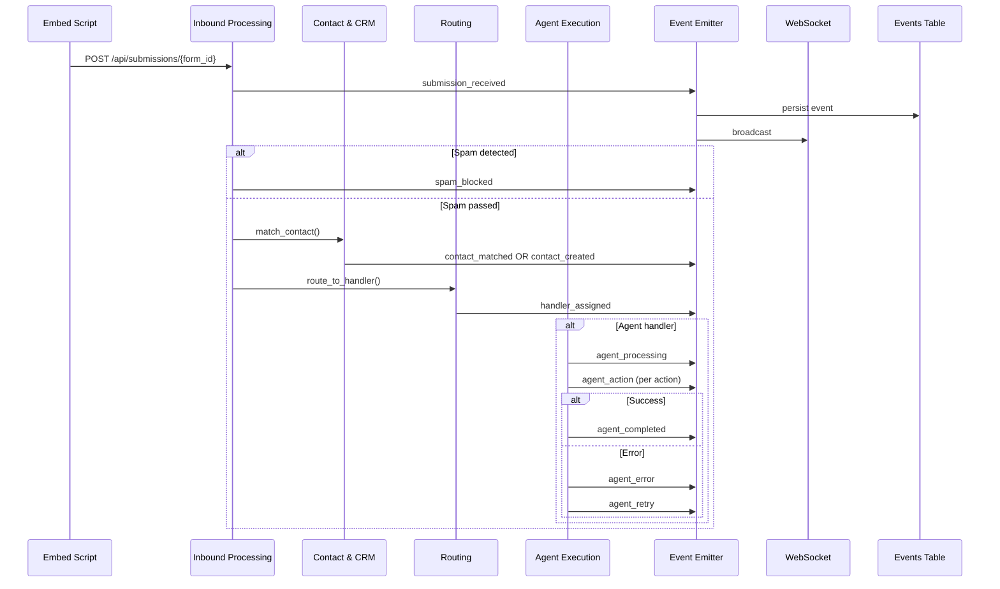

# Domain Events

> Events are facts about things that happened in the domain. They are emitted by aggregates and consumed by other contexts for side effects, projections, and observability.

See also: [Bounded Contexts](./bounded-contexts.md) | [Services](./services.md) | [Entities](./entities.md)

---

## Event Infrastructure

FormAgent uses two event channels:

1. **Database events table** -- all events are persisted to the `events` table for queryability and replay
2. **WebSocket broadcast** -- events are pushed in real-time to connected dashboard clients via `/ws/events`

Both channels carry the same payload. The event emitter service writes to the DB and broadcasts to WebSocket subscribers in a single operation.

---

## WebSocket Event Types (External)

These events are visible to dashboard users via the live activity stream.

### submission_received

A new form submission has been accepted and stored.

| Field | Description |
|-------|-------------|
| **Trigger** | Submission passes validation and anti-spam |
| **Source context** | Inbound Processing |
| **Payload** | `{ submission_id, form_id, form_name, contact_email, is_new }` |
| **Subscribers** | Analytics (KPI update), Dashboard (live feed) |

### spam_blocked

A submission was rejected by the anti-spam pipeline.

| Field | Description |
|-------|-------------|
| **Trigger** | Honeypot, rate limit, or duplicate check fails |
| **Source context** | Inbound Processing |
| **Payload** | `{ form_id, reason, ip_address, email }` |
| **Subscribers** | Analytics (spam counter), Dashboard (live feed) |

### contact_matched

A submission was linked to an existing contact record.

| Field | Description |
|-------|-------------|
| **Trigger** | Email lookup finds existing contact |
| **Source context** | Contact & CRM (via Inbound Processing) |
| **Payload** | `{ submission_id, contact_id, contact_email, submission_count }` |
| **Subscribers** | Dashboard (live feed) |

### contact_created

A new contact record was created from a submission.

| Field | Description |
|-------|-------------|
| **Trigger** | Email lookup finds no existing contact |
| **Source context** | Contact & CRM (via Inbound Processing) |
| **Payload** | `{ submission_id, contact_id, contact_email, form_id }` |
| **Subscribers** | Analytics (contacts created counter), Dashboard (live feed) |

### handler_assigned

A submission was routed to a handler (agent, human, or group member).

| Field | Description |
|-------|-------------|
| **Trigger** | Routing strategy selects a handler |
| **Source context** | Routing |
| **Payload** | `{ submission_id, handler_id, handler_type, group_id, strategy }` |
| **Subscribers** | Agent Execution (starts processing), Dashboard (live feed) |

### agent_processing

An agent has begun analyzing a submission.

| Field | Description |
|-------|-------------|
| **Trigger** | Agent pipeline starts Claude API call |
| **Source context** | Agent Execution |
| **Payload** | `{ submission_id, handler_id, form_id }` |
| **Subscribers** | Dashboard (live feed, status board update) |

### agent_action

An agent executed a specific action.

| Field | Description |
|-------|-------------|
| **Trigger** | Each action in the agent's plan is executed |
| **Source context** | Agent Execution |
| **Payload** | `{ submission_id, handler_id, action, status, details }` |
| **Subscribers** | Dashboard (live feed, timeline update) |

### agent_draft

An agent produced a draft for human review (draft or semi_autonomous mode).

| Field | Description |
|-------|-------------|
| **Trigger** | Agent completes analysis but autonomy level requires approval |
| **Source context** | Agent Execution |
| **Payload** | `{ submission_id, draft_id, handler_id, planned_actions }` |
| **Subscribers** | Dashboard (draft queue notification) |

### agent_completed

An agent finished processing a submission successfully.

| Field | Description |
|-------|-------------|
| **Trigger** | All agent actions executed or drafted |
| **Source context** | Agent Execution |
| **Payload** | `{ submission_id, handler_id, actions_taken, duration_ms }` |
| **Subscribers** | Analytics (processing time), Dashboard (live feed, status board) |

### agent_error

An agent encountered an error during processing.

| Field | Description |
|-------|-------------|
| **Trigger** | Claude API failure, parse error, or action execution failure |
| **Source context** | Agent Execution |
| **Payload** | `{ submission_id, handler_id, error_type, attempt, details }` |
| **Subscribers** | Error Recovery (initiates retry), Dashboard (live feed, status board) |

### agent_retry

The system is retrying after an agent error.

| Field | Description |
|-------|-------------|
| **Trigger** | Error recovery initiates a retry attempt |
| **Source context** | Agent Execution |
| **Payload** | `{ submission_id, handler_id, attempt, delay_ms }` |
| **Subscribers** | Dashboard (live feed) |

### agent_escalated

A submission was escalated to a human after agent could not handle it.

| Field | Description |
|-------|-------------|
| **Trigger** | Agent uses escalate action, or all retries exhausted |
| **Source context** | Agent Execution |
| **Payload** | `{ submission_id, handler_id, escalated_to, reason }` |
| **Subscribers** | Dashboard (notification to human handler) |

### human_approved

A human approved an agent's draft.

| Field | Description |
|-------|-------------|
| **Trigger** | Human clicks approve on a draft |
| **Source context** | Agent Execution |
| **Payload** | `{ draft_id, submission_id, reviewed_by }` |
| **Subscribers** | Agent Execution (executes planned actions), Dashboard (live feed) |

### human_rejected

A human rejected an agent's draft.

| Field | Description |
|-------|-------------|
| **Trigger** | Human clicks reject on a draft |
| **Source context** | Agent Execution |
| **Payload** | `{ draft_id, submission_id, reviewed_by, notes }` |
| **Subscribers** | Dashboard (live feed) |

### human_override

A human took over processing from an agent.

| Field | Description |
|-------|-------------|
| **Trigger** | Human manually intervenes on a submission |
| **Source context** | Agent Execution |
| **Payload** | `{ submission_id, handler_id, override_by }` |
| **Subscribers** | Dashboard (live feed) |

### experiment_variant

A submission was tagged with an A/B experiment variant.

| Field | Description |
|-------|-------------|
| **Trigger** | Schema endpoint selects a variant for the visitor |
| **Source context** | Experimentation |
| **Payload** | `{ submission_id, experiment_id, variant_id, form_id }` |
| **Subscribers** | Analytics (variant counters) |

### optimization_run

The autopilot ran an optimization cycle.

| Field | Description |
|-------|-------------|
| **Trigger** | POST /api/experiments/{id}/optimize is called |
| **Source context** | Experimentation |
| **Payload** | `{ experiment_id, action, promoted_variant, new_variant, stats }` |
| **Subscribers** | Dashboard (experiment panel update) |

---

## Internal Domain Events

These events are used for internal coordination between contexts. They may or may not be persisted to the events table depending on observability needs.

### form_created

| Field | Description |
|-------|-------------|
| **Trigger** | A new form is saved (via NL generation or manual creation) |
| **Source context** | Form Management |
| **Payload** | `{ form_id, workspace_id, name, type, flow_id }` |
| **Handlers** | Analytics (update form count) |

### form_updated

| Field | Description |
|-------|-------------|
| **Trigger** | Form configuration is modified |
| **Source context** | Form Management |
| **Payload** | `{ form_id, workspace_id, changed_fields }` |
| **Handlers** | Experimentation (check if active experiment affected) |

### form_archived

| Field | Description |
|-------|-------------|
| **Trigger** | Form is soft-deleted |
| **Source context** | Form Management |
| **Payload** | `{ form_id, workspace_id }` |
| **Handlers** | Experimentation (end active experiments), Marketing Automation (unlink from campaigns) |

### contact_updated

| Field | Description |
|-------|-------------|
| **Trigger** | Contact tags, custom fields, or status changed |
| **Source context** | Contact & CRM |
| **Payload** | `{ contact_id, workspace_id, changes }` |
| **Handlers** | Marketing Automation (evaluate stop conditions) |

### deal_created

| Field | Description |
|-------|-------------|
| **Trigger** | A new deal record is created |
| **Source context** | Contact & CRM |
| **Payload** | `{ deal_id, contact_id, workspace_id, amount, source_submission_id }` |
| **Handlers** | Marketing Automation (stop condition: `deal_created`), Analytics (revenue update) |

### deal_stage_changed

| Field | Description |
|-------|-------------|
| **Trigger** | Deal stage transitions (open -> won/lost) |
| **Source context** | Contact & CRM |
| **Payload** | `{ deal_id, workspace_id, old_stage, new_stage }` |
| **Handlers** | Analytics (deal funnel update) |

### experiment_started

| Field | Description |
|-------|-------------|
| **Trigger** | Experiment status changes to active |
| **Source context** | Experimentation |
| **Payload** | `{ experiment_id, form_id, workspace_id, variant_count }` |
| **Handlers** | Form Management (schema endpoint must check for experiments) |

### experiment_completed

| Field | Description |
|-------|-------------|
| **Trigger** | Experiment declares a winner or is manually ended |
| **Source context** | Experimentation |
| **Payload** | `{ experiment_id, form_id, workspace_id, winner_variant_id }` |
| **Handlers** | Form Management (apply winner overrides to base form) |

### sequence_enrolled

| Field | Description |
|-------|-------------|
| **Trigger** | A contact is enrolled in a nurture sequence |
| **Source context** | Marketing Automation |
| **Payload** | `{ enrollment_id, sequence_id, contact_id, workspace_id }` |
| **Handlers** | Analytics (enrollment counter) |

### sequence_step_sent

| Field | Description |
|-------|-------------|
| **Trigger** | Background processor sends a sequence step email |
| **Source context** | Marketing Automation |
| **Payload** | `{ enrollment_id, sequence_id, contact_id, step_number }` |
| **Handlers** | Contact & CRM (update last_seen), Analytics |

### sequence_completed

| Field | Description |
|-------|-------------|
| **Trigger** | Contact reaches the last step of a sequence |
| **Source context** | Marketing Automation |
| **Payload** | `{ enrollment_id, sequence_id, contact_id }` |
| **Handlers** | Analytics (completion counter) |

### sequence_stopped

| Field | Description |
|-------|-------------|
| **Trigger** | Stop condition met (contact_replied, deal_created, manual_stop, unsubscribed) |
| **Source context** | Marketing Automation |
| **Payload** | `{ enrollment_id, sequence_id, contact_id, stop_reason }` |
| **Handlers** | Analytics |

---

## Event Flow Diagram

