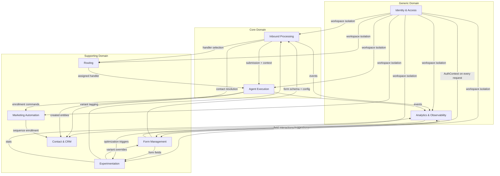
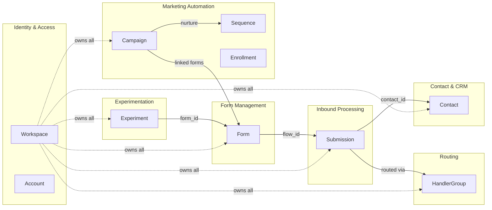

# FormAgent Domain Model

> FormAgent is an inbound execution system: forms as surface, AI agents as labor.

## Domain Overview

FormAgent operates at the intersection of form-based data capture, CRM contact management, AI-driven automation, and marketing experimentation. The core domain proposition is: a user describes what they need in natural language, the system generates a smart form backed by an AI agent, and every inbound submission is autonomously processed with full observability.

The domain decomposes into **9 bounded contexts** that collaborate to turn raw form submissions into qualified leads, deals, support tickets, and marketing enrollments -- all while learning and optimizing continuously.

## Strategic Domain Map

## Context Classification

| Context | Classification | Rationale |
|---------|---------------|-----------|
| **Inbound Processing** | Core | The central pipeline -- every submission flows through here |
| **Agent Execution** | Core | The AI labor that differentiates FormAgent from any form builder |
| **Form Management** | Supporting | Forms are the surface; essential but not the competitive edge |
| **Routing** | Supporting | Distribution logic for handler assignment |
| **Contact & CRM** | Supporting | Stateful memory that enriches agent decisions |
| **Marketing Automation** | Supporting | Campaigns and sequences for nurturing contacts |
| **Experimentation** | Supporting | A/B testing and self-optimization |
| **Identity & Access** | Generic | Authentication and multi-tenancy (standard patterns) |
| **Analytics & Observability** | Generic | Read-model dashboards and event streaming |

## Ubiquitous Language

| Term | Definition |
|------|-----------|
| **Typed Request** | Natural language prompt that generates a complete form configuration via Claude |
| **Flow** | A named processing pipeline (one of 6) that determines how a submission is handled |
| **Autonomy Level** | Trust setting controlling how independently an agent can act (notify_only, draft, semi_autonomous, fully_autonomous) |
| **Allowed Actions** | Guardrail checkboxes restricting which actions an agent may take |
| **Handler** | An entity (human or AI agent) that processes a submission |
| **Handler Group** | A reusable team with a routing strategy that distributes submissions among members |
| **Touchpoint** | A single interaction record on a contact's attribution chain |
| **Speed-to-Lead** | Time from submission received to first agent action |
| **Autopilot** | Automated experiment optimization where the system promotes winners and generates challengers |
| **Draft** | An agent's proposed actions awaiting human approval (in draft or semi_autonomous mode) |
| **Enrollment** | A contact's progression through a nurture sequence |
| **Workspace** | A tenant -- all data is strictly isolated per workspace |

## Aggregate Map

## Cross-References

- [Bounded Contexts](./bounded-contexts.md) -- detailed context definitions
- [Aggregates](./aggregates.md) -- aggregate roots and consistency boundaries
- [Entities](./entities.md) -- all domain entities with identity
- [Value Objects](./value-objects.md) -- immutable value types
- [Domain Events](./domain-events.md) -- event catalog
- [Repositories](./repositories.md) -- repository interfaces
- [Services](./services.md) -- domain and application services
