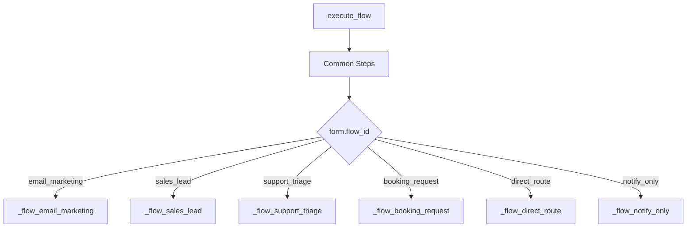
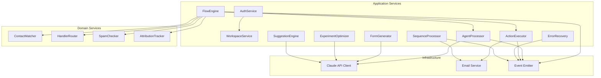

# Services

> Domain services encapsulate business logic that does not naturally belong to a single entity. Application services orchestrate workflows across aggregates and external systems.

See also: [Bounded Contexts](./bounded-contexts.md) | [Aggregates](./aggregates.md) | [Domain Events](./domain-events.md) | [Repositories](./repositories.md)

---

## Domain Services

Domain services contain pure business logic. They operate on domain objects, enforce invariants, and have no direct dependency on infrastructure (DB, HTTP, LLM APIs). They receive repositories as injected dependencies.

### ContactMatcher

**Context:** Contact & CRM
**Responsibility:** Resolve a submission to a contact and company record.

```python
class ContactMatcher:
    def __init__(self, contact_repo, company_repo): ...

    async def match_or_create_contact(
        self, workspace_id: str, email: str, name: str = None,
        phone: str = None, source: str = "inbound_form"
    ) -> tuple[Contact, bool]:
        """
        Returns (contact, is_new).
        If existing contact found by email: merge new data (fill blanks, don't overwrite).
        If not found: create new contact record.
        """

    async def match_or_create_company(
        self, workspace_id: str, company_name: str
    ) -> tuple[Company, bool]:
        """
        Returns (company, is_new).
        Matches by exact name within workspace.
        """

    async def link_contact_to_company(
        self, workspace_id: str, contact_id: str, company_id: str
    ) -> None:
        """Sets contact.company_id if not already set."""
```

**Key Rules:**
- Existing contact data is never overwritten -- only blank fields are filled
- Email is the primary match key (unique per workspace)
- Company matching is by exact name (case-insensitive)

### HandlerRouter

**Context:** Routing
**Responsibility:** Select the correct handler from a group using the configured strategy.

```python
class HandlerRouter:
    def __init__(self, handler_group_repo): ...

    async def route(
        self, workspace_id: str, group_id: str
    ) -> tuple[str, str]:
        """
        Returns (handler_id, handler_type).
        Executes the group's routing_strategy.
        Updates routing state atomically (round_robin index, assignment counts).
        Falls back to fallback_handler_id if no active members.
        Raises if no fallback available.
        """

    def _route_principal(self, group: HandlerGroup) -> GroupMember | None
    def _route_round_robin(self, group: HandlerGroup) -> GroupMember | None
    def _route_least_loaded(self, group: HandlerGroup) -> GroupMember | None
    def _route_broadcast(self, group: HandlerGroup) -> list[GroupMember]
```

**Strategy Implementations:**
- `principal` -- find the member with `role: "principal"`, fall back if inactive
- `round_robin` -- `(last_assigned_index + 1) % len(active_members)`, update index
- `least_loaded` -- min `assignment_count` among active members, increment count
- `broadcast` -- return all active members (all notified, first to claim)

### SpamChecker

**Context:** Inbound Processing
**Responsibility:** Run the anti-spam pipeline against a submission.

```python
class SpamChecker:
    def __init__(self, spam_log_repo): ...

    async def check(
        self, form: Form, submission_data: dict, meta: SubmissionMeta
    ) -> tuple[bool, str | None]:
        """
        Returns (passed, rejection_reason).
        Runs checks in order: honeypot, IP rate limit, email rate limit, duplicate.
        First failure stops the pipeline.
        All rejections are logged to spam_log.
        """

    def _check_honeypot(self, form: Form, data: dict) -> bool
    async def _check_ip_rate(self, form: Form, ip: str) -> bool
    async def _check_email_rate(self, form: Form, email: str) -> bool
    async def _check_duplicate(self, form: Form, email: str) -> bool
```

**Key Rules:**
- Honeypot rejection returns HTTP 200 (to avoid tipping off bots)
- Rate limit rejections return HTTP 429
- Duplicate rejections return HTTP 422
- Thresholds come from `form.security_config`

### AttributionTracker

**Context:** Contact & CRM / Analytics
**Responsibility:** Record touchpoints and compute attribution.

```python
class AttributionTracker:
    def __init__(self, contact_repo): ...

    async def track_touchpoint(
        self, workspace_id: str, contact_id: str,
        submission_id: str, form_id: str, meta: SubmissionMeta
    ) -> None:
        """
        Appends a Touchpoint to the contact's touchpoints array.
        Extracts UTMs, page_url from submission meta.
        """

    def compute_first_touch(self, contact: Contact) -> Touchpoint | None:
        """Returns the earliest touchpoint (first interaction)."""

    def compute_last_touch(self, contact: Contact) -> Touchpoint | None:
        """Returns the most recent touchpoint (conversion attribution)."""

    def compute_full_path(self, contact: Contact) -> list[Touchpoint]:
        """Returns all touchpoints in chronological order."""
```

---

## Application Services

Application services orchestrate workflows, coordinate multiple domain services and repositories, interact with external systems (Claude API, email), and manage transaction boundaries.

### AuthService

**Context:** Identity & Access
**Responsibility:** Handle authentication flows (signup, login, JWT, API keys).

```python
class AuthService:
    def __init__(self, account_repo, workspace_repo): ...

    async def signup(self, email: str, password: str, name: str, workspace_name: str) -> dict:
        """
        1. Validate email format, password strength
        2. Hash password with bcrypt
        3. Create account
        4. Create workspace (owner = new account)
        5. Create membership (role = owner)
        6. Generate JWT
        7. Create session
        8. Activate any pending memberships for this email
        Returns { token, account, workspace }
        """

    async def login(self, email: str, password: str) -> dict:
        """
        1. Find account by email
        2. Verify password
        3. Load workspaces via memberships
        4. Auto-select if single workspace
        5. Generate JWT, create session
        Returns { token, account, workspace, workspaces[] }
        """

    async def logout(self, session_id: str) -> None
    async def switch_workspace(self, account_id: str, workspace_id: str) -> dict
    async def validate_jwt(self, token: str) -> AuthContext
    async def validate_api_key(self, key: str) -> AuthContext

    def _hash_password(self, password: str) -> str
    def _verify_password(self, password: str, hash: str) -> bool
    def _generate_jwt(self, account_id: str, workspace_id: str, role: str) -> str
```

### WorkspaceService

**Context:** Identity & Access
**Responsibility:** Workspace lifecycle and member management.

```python
class WorkspaceService:
    def __init__(self, workspace_repo, account_repo): ...

    async def create_workspace(self, account_id: str, name: str) -> Workspace
    async def update_workspace(self, workspace_id: str, settings: dict) -> Workspace
    async def invite_member(self, workspace_id: str, inviter_id: str, email: str, role: str) -> WorkspaceMembership
    async def update_member_role(self, workspace_id: str, membership_id: str, role: str) -> WorkspaceMembership
    async def remove_member(self, workspace_id: str, membership_id: str) -> None
```

### FlowEngine

**Context:** Inbound Processing
**Responsibility:** Orchestrate the full submission processing pipeline.

This is the central application service. It coordinates across multiple bounded contexts.

```python
class FlowEngine:
    def __init__(
        self,
        form_repo, submission_repo, contact_matcher, company_repo,
        attribution_tracker, handler_router, agent_processor,
        action_executor, event_emitter, campaign_repo, enrollment_repo
    ): ...

    async def execute_flow(self, workspace_id: str, submission: Submission, form: Form) -> None:
        """
        Dispatches to the appropriate flow based on form.flow_id.
        Common steps (contact match, company match, attribution) run first.
        Flow-specific steps follow.
        """

    async def _common_steps(self, workspace_id: str, submission: Submission, form: Form) -> None:
        """match_contact, match_company, track_attribution"""

    async def _flow_email_marketing(self, ...) -> None
    async def _flow_sales_lead(self, ...) -> None
    async def _flow_support_triage(self, ...) -> None
    async def _flow_booking_request(self, ...) -> None
    async def _flow_direct_route(self, ...) -> None
    async def _flow_notify_only(self, ...) -> None
```

**Flow dispatch:**


### AgentProcessor

**Context:** Agent Execution
**Responsibility:** Build prompts, call Claude API, parse structured responses.

```python
class AgentProcessor:
    def __init__(self, claude_client, contact_repo, event_emitter): ...

    async def process(
        self, workspace_id: str, submission: Submission,
        form: Form, contact: Contact, handler_id: str
    ) -> dict:
        """
        1. Build system prompt with form context, submission data, contact history
        2. Call Claude API with structured output (JSON action plan)
        3. Parse and validate response
        4. Return { reasoning, actions[], contact_updates }
        """

    def _build_system_prompt(self, form: Form, submission: Submission, contact: Contact) -> str
    def _build_user_prompt(self, submission: Submission) -> str
    def _parse_response(self, raw_response: str) -> dict
    def _validate_actions(self, actions: list, allowed_actions: list) -> list
```

**Key Rules:**
- Actions not in `allowed_actions` are stripped and logged as violations
- Response must be valid JSON matching the expected schema
- If parse fails, re-prompt with stricter format instructions (one retry)

### ActionExecutor

**Context:** Agent Execution
**Responsibility:** Execute individual agent actions against the system.

```python
class ActionExecutor:
    def __init__(
        self, contact_repo, deal_repo, enrollment_repo,
        email_service, event_emitter
    ): ...

    async def execute(
        self, workspace_id: str, action: str, details: dict,
        submission: Submission, contact: Contact
    ) -> dict:
        """
        Dispatches to the appropriate action handler.
        Returns { status, entity_id?, error? }
        """

    async def _qualify_lead(self, ...) -> dict
    async def _send_email(self, ...) -> dict
    async def _create_deal(self, ...) -> dict
    async def _create_ticket(self, ...) -> dict
    async def _book_meeting(self, ...) -> dict
    async def _enroll_sequence(self, ...) -> dict
    async def _escalate(self, ...) -> dict
    async def _respond_direct(self, ...) -> dict
```

### ErrorRecovery

**Context:** Agent Execution
**Responsibility:** Retry failed operations with backoff and escalation.

```python
class ErrorRecovery:
    def __init__(self, error_repo, event_emitter): ...

    async def handle_error(
        self, workspace_id: str, submission_id: str,
        error_type: str, details: str, attempt: int
    ) -> str:
        """
        1. Log error to error table
        2. If attempt < max_retries: schedule retry with backoff
        3. If max_retries exhausted: escalate to fallback handler
        4. Emit appropriate event (agent_retry or agent_escalated)
        Returns recovery_action: "retry", "escalated", "failed"
        """

    def _compute_backoff(self, attempt: int) -> int:
        """Exponential backoff: 2s, 4s, 8s"""
```

**Retry Policy:**
- LLM timeout: 3 attempts (2s, 4s, 8s backoff)
- Unparseable response: re-prompt once, then escalate
- Action failure: 1 retry, then log and continue
- All retries exhausted: mark `needs_human_review`, notify fallback handler

### SequenceProcessor

**Context:** Marketing Automation
**Responsibility:** Background job that processes due enrollment steps.

```python
class SequenceProcessor:
    def __init__(
        self, enrollment_repo, sequence_repo, contact_repo,
        email_service, event_emitter
    ): ...

    async def process_due_steps(self) -> int:
        """
        Called every 60 seconds by the background scheduler.
        1. Query enrollments WHERE status='active' AND next_step_due_at <= now()
        2. For each: check stop conditions
        3. If stop condition met: stop enrollment, record reason
        4. Send current step email (with variable substitution)
        5. If last step: mark completed
        6. Else: compute next_step_due_at from next step delay
        Returns count of steps processed.
        """

    async def _check_stop_conditions(self, enrollment: Enrollment, contact: Contact) -> str | None
    async def _send_step_email(self, step: SequenceStep, contact: Contact) -> bool
    def _substitute_variables(self, template: str, contact: Contact) -> str
    def _compute_next_due(self, next_step: SequenceStep) -> str
```

### FormGenerator

**Context:** Form Management (LLM layer)
**Responsibility:** Generate form configurations from natural language prompts.

```python
class FormGenerator:
    def __init__(self, claude_client): ...

    async def generate(self, prompt: str, conversation_history: list = None) -> dict:
        """
        1. Build system prompt with available field types, flows, and schema
        2. Include conversation history for iterative refinement
        3. Call Claude API
        4. Parse JSON response
        5. Validate against form schema
        Returns draft form configuration (not saved).
        """

    def _build_system_prompt(self) -> str
    def _parse_form_config(self, raw: str) -> dict
    def _validate_config(self, config: dict) -> list[str]  # Returns validation errors
```

### ExperimentOptimizer

**Context:** Experimentation (LLM layer)
**Responsibility:** Analyze experiment results and generate new challenger variants.

```python
class ExperimentOptimizer:
    def __init__(self, claude_client, experiment_repo, submission_repo, form_repo): ...

    async def optimize(self, workspace_id: str, experiment_id: str) -> dict:
        """
        1. Load experiment, validate status=active
        2. Compute per-variant stats
        3. Check min_sample_size
        4. Determine winner (>10% improvement required)
        5. Apply winner overrides to base form
        6. Generate new challenger via Claude
        7. Update experiment with new variant
        8. Log to optimization_log
        Returns { action, promoted?, new_variant?, stats }
        """

    async def _compute_variant_stats(self, workspace_id: str, experiment: Experiment) -> list[dict]
    async def _generate_challenger(self, form: Form, stats: list[dict], metric: str) -> dict
    def _determine_winner(self, stats: list[dict], metric: str) -> str | None
```

**Guardrails:**
- Winner must beat runner-up by >10%
- All variants must have >= `min_sample_size` submissions
- Required fields from base form cannot be removed
- Auto-rollback if performance drops >15% within 48h

### SuggestionEngine

**Context:** Analytics & Observability (LLM layer)
**Responsibility:** Analyze form performance and produce optimization suggestions.

```python
class SuggestionEngine:
    def __init__(self, claude_client, submission_repo, event_repo): ...

    async def analyze(self, workspace_id: str, form_id: str) -> list[dict]:
        """
        1. Load field completion rates from field_interactions
        2. Load outcome distribution
        3. Load agent notes patterns
        4. Load response times
        5. Load common escalation reasons
        6. Load A/B experiment results if any
        7. Build analysis prompt for Claude
        8. Parse suggestions from response
        Returns list of { suggestion, reasoning, action_type, action_data }
        """
```

**Suggestion Types:**
- Remove underperforming field
- Add missing field (based on agent conversation patterns)
- Reorder fields to reduce dropoff
- Adjust agent instructions
- Create targeted sub-form for high-converting segment

---

## Service Dependency Graph


