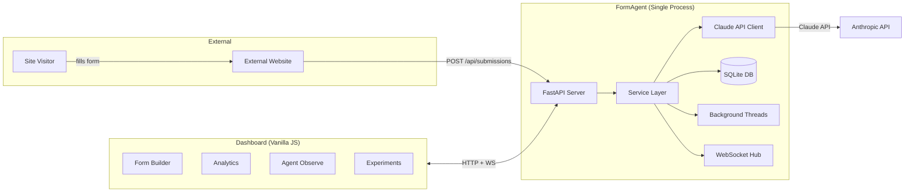
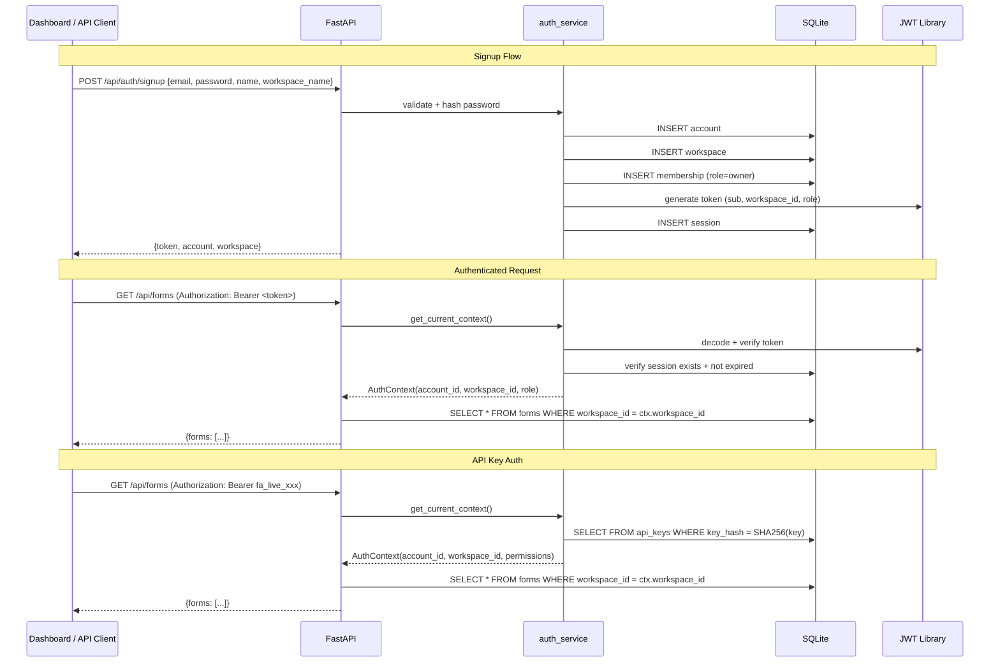
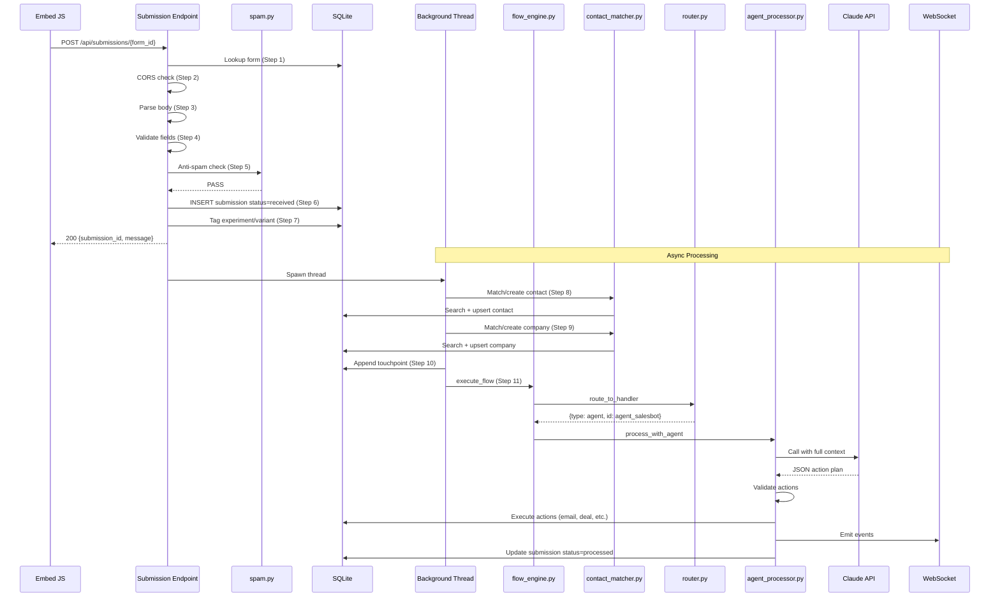
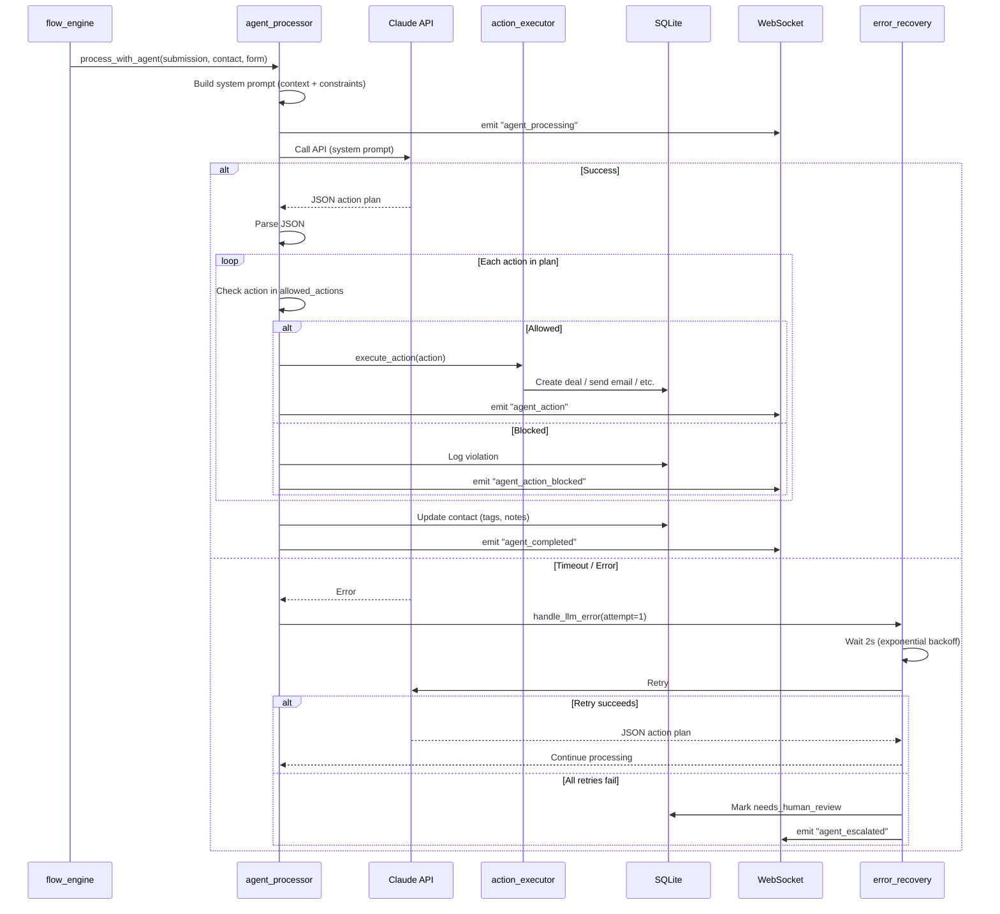
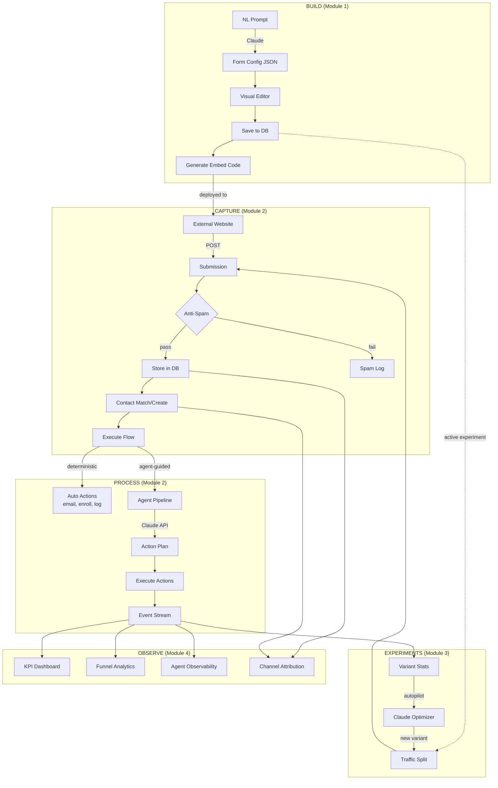
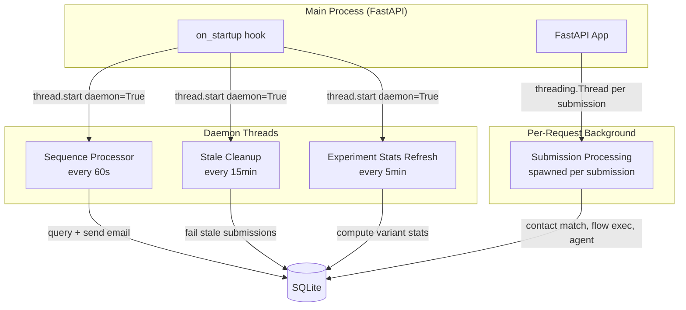
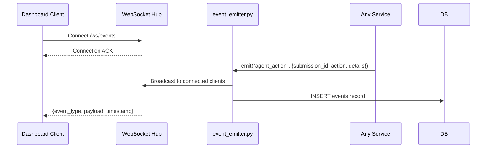
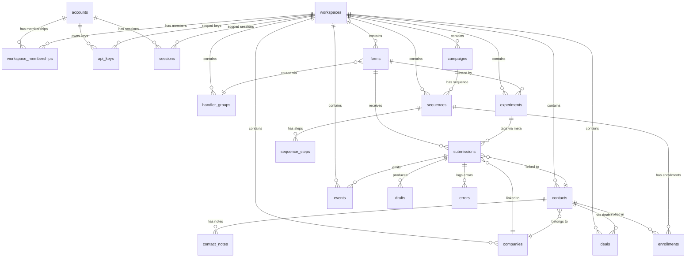

# FormAgent -- SPARC Architecture

> Cross-references: [Specification](./01-specification.md) | [Pseudocode](./02-pseudocode.md) | [Domain Model](../ddd/domain-model.md)

---

## 1. High-Level System Diagram



---

## 2. Component / Layer Architecture

```mermaid
graph TB
    subgraph "API Layer (FastAPI Routers)"
        auth_api[auth.py]
        workspaces_api[workspaces.py]
        api_keys_api[api_keys.py]
        forms_api[forms.py]
        submissions_api[submissions.py]
        contacts_api[contacts.py]
        deals_api[deals.py]
        groups_api[handler_groups.py]
        campaigns_api[campaigns.py]
        sequences_api[sequences.py]
        experiments_api[experiments.py]
        drafts_api[drafts.py]
        analytics_api[analytics.py]
        events_api[events.py]
    end

    subgraph "Middleware"
        auth_ctx[auth_context.py<br/>get_current_context]
    end

    subgraph "Service Layer"
        auth_svc[auth_service.py]
        workspace_svc[workspace_service.py]
        flow_eng[flow_engine.py]
        spam_svc[spam.py]
        contact_match[contact_matcher.py]
        router_svc[router.py]
        agent_proc[agent_processor.py]
        action_exec[action_executor.py]
        err_recovery[error_recovery.py]
        event_emit[event_emitter.py]
        seq_proc[sequence_processor.py]
        attrib_svc[attribution.py]
        stale_svc[stale_cleanup.py]
    end

    subgraph "LLM Layer"
        form_gen[form_generator.py]
        agent_prompts[agent_prompts.py]
        optimizer[optimizer.py]
        suggest_eng[suggestion_engine.py]
    end

    subgraph "Models Layer (Pydantic)"
        models[auth.py, form.py, submission.py,<br/>contact.py, deal.py, handler_group.py,<br/>campaign.py, sequence.py, experiment.py,<br/>draft.py, event.py]
    end

    subgraph "Database"
        database[database.py + SQLite file]
    end

    auth_ctx --> auth_svc
    forms_api --> auth_ctx
    submissions_api --> flow_eng
    flow_eng --> spam_svc
    flow_eng --> contact_match
    flow_eng --> router_svc
    flow_eng --> agent_proc
    agent_proc --> action_exec
    agent_proc --> err_recovery
    flow_eng --> event_emit
    experiments_api --> optimizer
    analytics_api --> suggest_eng
    forms_api --> form_gen
```



---

## 3. Auth Flow Diagram



---

## 4. Submission Processing Sequence Diagram



---

## 5. Agent Execution Sequence



---

## 6. Data Flow Diagram



---

## 7. Background Jobs Architecture



| Job | Interval | Description |
|-----|----------|-------------|
| Sequence Processor | 60s | Query enrollments where `next_step_due_at <= NOW`, send emails, advance steps |
| Stale Cleanup | 15 min | Mark submissions stuck in `processing` > 30min as `failed` |
| Experiment Stats | 5 min | Pre-compute variant stats for active experiments |

---

## 8. WebSocket Event Flow



The WebSocket hub maintains a set of connected clients. Events are broadcast to all connected dashboard sessions within the same workspace. The `event_emitter` is the single point of emission -- every service writes events through it, ensuring both persistence (to `events` table) and real-time delivery (to WebSocket).

---

## 9. Database Relationship Diagram



### Table Summary (20 Tables)

| # | Table | workspace_id | Key Relationships |
|---|-------|-------------|-------------------|
| 1 | `accounts` | N/A (global) | Owner of workspaces |
| 2 | `workspaces` | IS the tenant | Contains all scoped data |
| 3 | `workspace_memberships` | FK | Links accounts to workspaces |
| 4 | `api_keys` | FK | Scoped to workspace |
| 5 | `sessions` | FK | JWT session tracking |
| 6 | `forms` | FK | Central entity; receives submissions |
| 7 | `submissions` | FK (denormalized) | Links to form, contact, company |
| 8 | `contacts` | FK | Unique per (workspace, email) |
| 9 | `contact_notes` | via FK | Append-only notes on contacts |
| 10 | `companies` | FK | Linked to contacts |
| 11 | `deals` | FK | Linked to contacts, companies |
| 12 | `handler_groups` | FK | Routing config with members JSON |
| 13 | `campaigns` | FK | Marketing containers |
| 14 | `sequences` | FK | Email drip definitions |
| 15 | `sequence_steps` | via FK | Ordered steps in a sequence |
| 16 | `enrollments` | FK | Contact progress through sequence |
| 17 | `experiments` | FK | A/B tests on forms |
| 18 | `drafts` | FK | Agent draft actions awaiting approval |
| 19 | `spam_log` | FK | Rejected submission log |
| 20 | `events` | FK | Activity stream + observability |

Note: `errors` table (21st if counted separately) stores error recovery logs.

---

## 10. Deployment View

```mermaid
graph TB
    subgraph "Single Server / Process"
        subgraph "Python Process"
            FastAPI[FastAPI + Uvicorn]
            Threads[Daemon Threads x3]
        end
        SQLite[(formagent.db)]
        Static[/frontend/ static files]
    end

    subgraph "External"
        Claude[Anthropic Claude API]
        SMTP[SMTP Server]
    end

    Browser[Dashboard Browser] -->|HTTP/WS| FastAPI
    EmbedSite[External Website] -->|HTTP POST| FastAPI
    FastAPI --> SQLite
    FastAPI --> Static
    FastAPI --> Claude
    FastAPI --> SMTP
    Threads --> SQLite
    Threads --> SMTP
```

**Deployment characteristics:**
- Single Python process (Uvicorn with FastAPI)
- SQLite database: single file (`formagent.db`), no separate DB server
- Static frontend served by FastAPI (or separate static file server)
- Background work handled by daemon threads (not Celery, not Redis)
- External dependencies: Anthropic Claude API, SMTP server (or mock)
- Environment variables: `CLAUDE_API_KEY`, `JWT_SECRET`, `SMTP_*` settings
